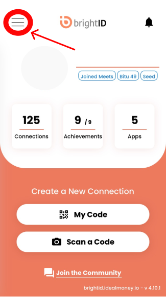
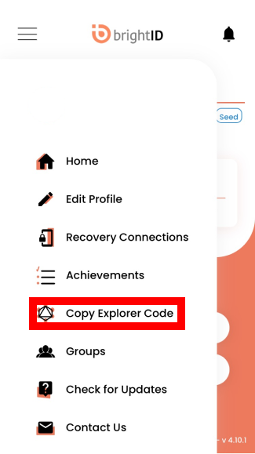
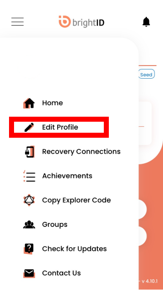

# Aura Login

To access the Aura App you must use your BrightID Explorer Code and Password.

Follow the steps below to locate your credentials.

## Find your Explorer Code and Password

### Explorer Code
In the BrightID mobile app, click the menu button at the top left. 

Click Copy Explorer Code

Click the Copy Code Button

### Password

Click the menu buttton at the top left and click Edit Profile

Click View Password

