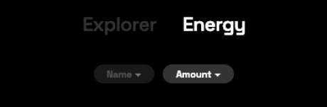
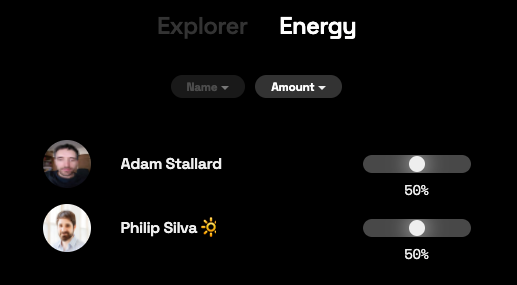

# Energy

## Search for Users

Use the search bar at the top of the page to locate specific users.

## Your Energy

The amount of energy you have available to allocate is displayed at tht top of the page.

## Explorer

The energy explorer view displays the amount of inbound/outbound energy being sent between you and your connections, and can be filtered by name of user and amount of energy.

## Energy Allocation

Energy allocation can also be filtere by name and amount. Use the sliders to distribute energy to your connections. You can allocate up to 100% of your energy, and are encouraged to allocate the entire amount between your chosen connections.

