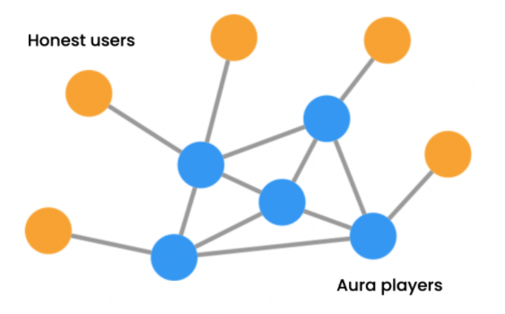

# How Aura works

## Types of users

Based on observations of BrightID user participation, we can divide users into two categories.

### App users

App users represent 95% of users. They’re interested in BrightID as a way to use or enhance a particular app they care about. They’ll do what they need to do to get verified and not much else.

### Inquisitive users

Inquisitive users represent 5% of the user base. They use apps, but also become interested in how BrightID works. Once they’ve been verified, they begin to explore what else is possible with BrightID. They’re capable of noticing attempts by other users to exploit the system. They think about how attacks might succeed and how they might be prevented.

## The Aura social graph

Aura players consist of inquisitive users. They assign honesty points to those they know well. This contrasts with normal BrightID users, who in most cases only label how well they know someone and don’t try to assess their honesty.

Aura players send each other energy, which represents the power to verify other BrightID users. This results in an inner graph composed of Aura players and an outer graph of the rest of BrightID users _(3)_.

##### Citations

3. [SybilRank](https://www.usenix.org/conference/nsdi12/technical-sessions/presentation/cao) uses far fewer resources in the Aura social graph because the power iteration only flows energy through the inner graph of Aura users. Other BrightID users are connected by a single hop to the inner graph. Verification depends on the honesty ratings given to a user and the energy levels of the players giving them those ratings. (Only Aura players have energy.) This is a simple calculation that can be done on the fly when a user requests a verification.
