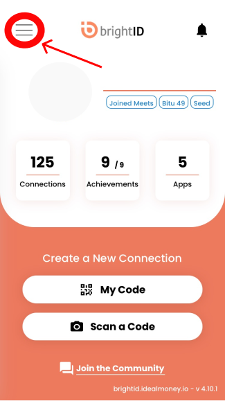
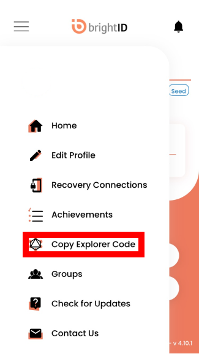
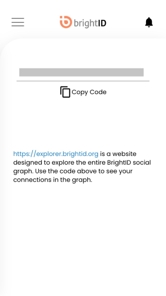
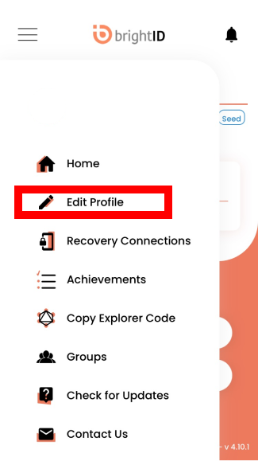

# Aura Intro

To access the Aura App you must use your BrightID Explorer Code and Password.

Follow the steps below to locate your credentials.

## Find your Explorer Code and Password

### Explorer Code
In the BrightID mobile app, click the menu button at the top left. 

Click Copy Explorer Code

Click the Copy Code Button

### Password

Click the menu buttton at the top left and click Edit Profile

Click View Password

## Get the BrightID App

If you do not have BrightID, you must first install it on your mobile device.

[Apple App Store](https://apps.apple.com/us/app/brightid/id1428946820)

[Google Play App Store](https://play.google.com/store/apps/details?id=org.brightid)