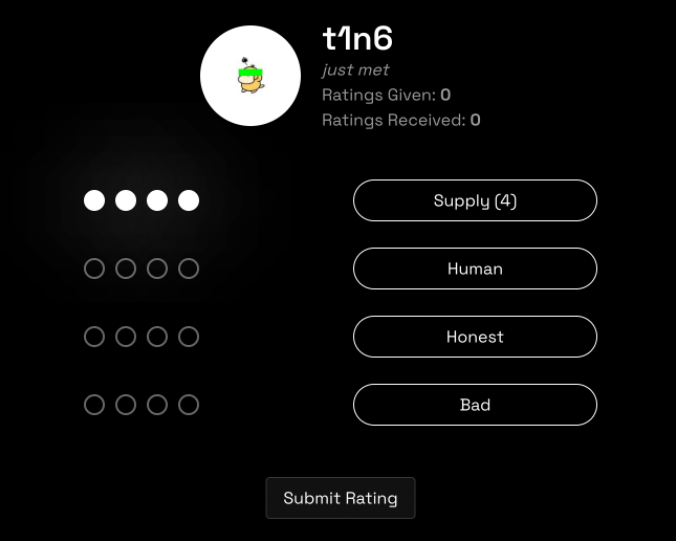
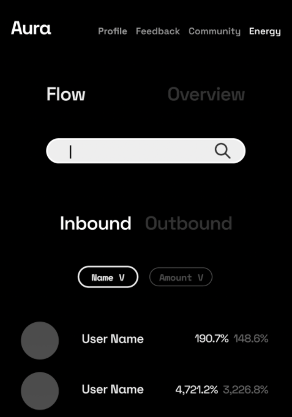

# Aura Verification

Becoming verified through Aura is simple for regular BrightID users. They don’t need to use Aura; they just need to connect to at least one Aura player. The player will rate the honesty of the user using the tools available to them.

It may take time for a new BrightID user to find an Aura player that knows them well enough to rate their honesty. The time will reduce as the number of BrightID and Aura users grows.

## Verification tools

The Aura interface is a set of tools to help players judge BrightID users’ honesty and assign energy to other players.

## Mutual connections

Players look at their mutual connections with other users. If expected “already known” connections are missing, this could be a sign of a sybil attack, and a player will withhold honesty points.

## Energy Flows

Players look at inbound and outbound energy flows for players they assign energy to. Players are responsible for the energy they give to immediate downstream players, and should cut off energy to suspicious players.

## Activity alerts

Players are alerted to changes in activity from immediate downstream players. This could include changes to their inbound and outbound energy, or to the group of BrightID users receiving honesty points from them. Players should cut off energy to suspicious players.