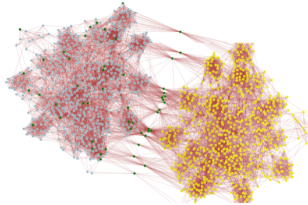

# Why Aura?

## Social graph analysis briefly explained

BrightID verification is based on person to person connections. This creates a social graph. Attackers create duplicate accounts (sybils) and connect them to the graph, hoping to pass them off as real people.

_Yellow nodes represent a sybil attack. Green nodes represent seeds, which help to identify the honest part of the graph (blue nodes)._

Verification methods analyze the structure of the anonymous graph of connections (1). People need to be sufficiently connected to the honest part of the graph to become verified. Analysis methods find the “honest part” using seeds or pre-trusted people.

## Goals for selecting seeds _(2)_

1. All communities should have access to seeds.
2. Suspicious connections to seeds are pruned.
3. Seeds are manually checked for honesty. Ideally, this is decentralized.

## Social Engineering

Sybil attackers try to connect their sybil accounts to honest users in order to have more connections to the honest part of the graph and get verified.

## Skin in the game

In order to prevent social engineering attacks, any connection that will increase the likelihood of  a sybil getting verified should be prevented. The honest target should be motivated and equipped to prevent such connections.

##### Citations

1. [https://nymity.ch/sybilhunting/pdf/Yu2006a.pdf](https://nymity.ch/sybilhunting/pdf/Yu2006a.pdf), [https://github.com/BrightID/BrightID-AntiSybil/wiki/Anti-Sybil-Systems](https://github.com/BrightID/BrightID-AntiSybil/wiki/Anti-Sybil-Systems)

2. [https://www.usenix.org/conference/nsdi12/technical-sessions/presentation/cao](https://www.usenix.org/conference/nsdi12/technical-sessions/presentation/cao), [https://proceedings.mlr.press/v45/Zhang15b.html](https://proceedings.mlr.press/v45/Zhang15b.html), [https://www.researchgate.net/publication/303789185_Trust-Based_Sybil_Nodes_Detection_with_Robust_Seed_Selection_and_Graph_Pruning_on_SNS](https://www.researchgate.net/publication/303789185_Trust-Based_Sybil_Nodes_Detection_with_Robust_Seed_Selection_and_Graph_Pruning_on_SNS)
